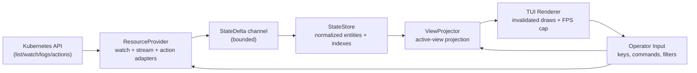

# krust

[](https://github.com/ErfanY/krust/actions/workflows/ci.yml)
[](https://github.com/ErfanY/krust/actions/workflows/release.yml)
[](LICENSE)
[](https://kubernetes.io/)
[Release Status](docs/status.md)

`krust` is a latency-first Kubernetes terminal navigator for operators who work across many clusters and large resource sets.

It is intentionally focused on fast core workflows (navigation, inspect, logs, safe edits/actions) with high k9s shortcut compatibility, while keeping API pressure and UI jitter under control.

Built with Rust (`tokio`, `kube`, `kube_runtime`, `ratatui`) and compiled against Kubernetes `1.33+` APIs (`k8s-openapi` `v1_33`).

## Why krust

Most terminal Kubernetes tools become noisy or sluggish when context count and watch volume grow. `krust` is designed around a different default:

- activate only the watch scope needed for what you are currently looking at
- keep render work invalidation-driven with a frame cap
- keep logs bounded and stream-focused
- treat RBAC denials and API turbulence as normal operational states

This is also why plugins are out of scope for v1: predictable latency and operational clarity come first.

## Scope and Non-Goals

What `krust` is:

- keyboard-first multi-context Kubernetes navigator
- read-heavy operations with guarded mutations
- high-signal terminal UI for SRE/platform workflows

What `krust` is not:

- a plugin/script execution platform
- a replacement for full GitOps pipelines or IDE workflows
- a "watch everything everywhere" cluster crawler at startup

## Feature Matrix

| Area | Status | Notes |
| --- | --- | --- |
| Multi-context session | Implemented | Context tabs with fast switching and warm-context retention |
| Namespace scoping | Implemented | Namespace picker and `all` namespace mode |
| Core resource browser | Implemented | Pods, Deployments, RS, STS, DS, Services, Ingresses, ConfigMaps, Secrets, Jobs, CronJobs, PVC/PV, Nodes, Namespaces, Events, SA, Roles, RB/CR/CRB, NetPol, HPA, PDB |
| Describe pane | Implemented | YAML/JSON view toggle with syntax highlighting |
| Secret decode pane | Implemented | Decoded view + edit/apply with automatic base64 re-encode |
| Logs pane | Implemented | Streaming with pause/tail/source filtering; pod multi-container and deploy/rs replica fan-out |
| Edit/apply | Implemented | External editor flow from describe/decode panes |
| Delete action | Implemented | Guarded delete path (currently Pods) |
| k9s-style commands/aliases | Partial parity | Core resource commands and navigation implemented; plugin commands intentionally out of scope |
| Plugin subsystem | Out of scope | Deliberately excluded for performance and simplicity |

## Compatibility

- OS: macOS, Linux
- Kubernetes: `1.33+`
- Auth: standard kubeconfig + exec auth providers
- Terminal: basic color through truecolor; OSC52 clipboard fallback supported

## Installation and Quick Start

### Install from GitHub Releases (recommended)

Prebuilt archives are published for:

- `x86_64-unknown-linux-gnu`
- `x86_64-apple-darwin`
- `aarch64-apple-darwin`

Example (Linux x86_64):

```bash
curl -L -o krust.tar.gz \
  https://github.com/ErfanY/krust/releases/latest/download/krust-x86_64-unknown-linux-gnu.tar.gz

tar -xzf krust.tar.gz
sudo install krust-x86_64-unknown-linux-gnu/krust /usr/local/bin/krust
```

### Install from source

```bash
cargo install --git https://github.com/ErfanY/krust.git --locked krust
```

### Homebrew (tap-based)

```bash
brew tap ErfanY/krust
brew install krust
```

### Build locally

```bash
cargo build --release
```

Binary path:

```bash
target/release/krust
```

### Publish a GitHub release

Main-branch publish (default):

```bash
git push origin main
```

On each push to `main`, the `Release` workflow will:
- run validation (`fmt`, `check`, `test`, `build`)
- compute the next semver (`major` on `BREAKING CHANGE`/`!`, `minor` on `feat:`, otherwise `patch`)
- bump package version in `Cargo.toml`
- create and push the release tag
- build and upload release artifacts
- verify required release assets are present on GitHub Releases
- sync latest formula to Homebrew tap (`ErfanY/homebrew-krust`)
- update `docs/status.md`

Manual publish override:

- Run Actions workflow `Release`
- Provide `version` (`0.1.0` or `v0.1.0`)

The workflow builds platform artifacts, publishes a GitHub Release, uploads:
- `krust-*.tar.gz`
- `SHA256SUMS`
- `krust.rb`

### Run

```bash
krust
krust --context <context-name>
krust --namespace <namespace>
krust --readonly
krust --kubeconfig <path>
krust --all-contexts
```

### CLI flags

- `--context`: initial context
- `--namespace`: initial namespace scope
- `--readonly`: disable mutations
- `--kubeconfig`: explicit kubeconfig path
- `--all-contexts`: eager auth/client warmup across all contexts

## Configuration

Runtime/UI config path:

- `~/.config/krust/config.toml`

Keymap override path:

- `~/.config/krust/keymap.toml`

Example `config.toml`:

```toml
[runtime]
fps_limit = 60
delta_channel_capacity = 2048
warm_contexts = 1
warm_context_ttl_secs = 20

[ui]
theme = "default"
show_help = true
```

Defaults for initial context/namespace come from kubeconfig unless CLI flags override them.

## Quick UX Reference

### Core navigation

- `tab` / `shift+tab`: switch context tabs
- `j` / `k` (or arrows): move in tables, scroll in detail panes
- `Enter`: select namespace in namespace view, otherwise open describe
- `d`: describe
- `ctrl+d`: delete (guarded)
- `x`: secret decode view toggle
- `l`: logs pane
- `s`: log tail toggle
- `p`: pause/resume logs
- `S`: log source selector
- `c`: container selector

### Search and command bar

- `/`: filter in table/overlay panes, search in detail/log panes
- `?`: detail/search shortcut
- `n` / `N`: next/previous search match in detail/log panes
- `:`: command mode (`:ctx`, `:ns`, `:po`, `:kind`, `:edit`, `:fmt`, etc.)
- `tab` in command mode: autocomplete
- `ctrl+w` in command/filter mode: delete previous word

### Detail viewing

- `w`: wrap toggle
- left/right: horizontal scroll (wrap off)
- `gg` / `G`: top/bottom
- `ctrl+u` / `ctrl+d`: half-page up/down
- `y`: copy current view
- `:dump <path>`: write current view to file

### Format and edit

- `:fmt yaml|json` or `:yaml` / `:json`
- `e` or `:edit [yaml|json]`

## Architecture Overview

`krust` uses a layered architecture to isolate cluster IO, state mutation, projection, and rendering.



Design details are documented in:

- [`docs/architecture.md`](docs/architecture.md)
- [`docs/performance.md`](docs/performance.md)

## Performance Model (Operator-Facing)

`krust` prioritizes consistent interactivity over maximum background data ingestion.

- watch scope is reconciled to active context/pane needs
- recently used contexts can stay warm with TTL
- render loop is invalidation-driven with FPS cap
- logs are ring-buffered with source filtering and bounded drain
- forbidden RBAC watches are disabled for that context/resource (no retry floods)

For deeper technical details and tuning guidance, see [`docs/performance.md`](docs/performance.md).

## Safety Model

- `--readonly` blocks mutating actions
- destructive action path is confirmation-guarded
- RBAC/action failures are surfaced with explicit status messaging
- secret decode editing converts decoded values back to base64 automatically

## Troubleshooting

### `403 Forbidden` warnings for some resources

This is usually expected RBAC scope mismatch. `krust` disables forbidden watchers for that resource/context to avoid reconnect storms.

### Long startup with many contexts

Default mode is lazy. If startup still feels heavy, avoid `--all-contexts` and keep `warm_contexts` low.

### Clipboard copy issues

`krust` uses platform-native commands first (`pbcopy` / `wl-copy` / `xclip` / `xsel`) and falls back to OSC52 where supported.

### Auth works in shell but not in app environment

Ensure your terminal session has the same kube auth env/credentials as your shell where `kubectl` succeeds.

## Contributing

Contribution guide, PR standards, and performance review expectations live in [`CONTRIBUTING.md`](CONTRIBUTING.md).

## Roadmap (Near Term)

- wider mutation action set (scale/restart/etc.) with guardrails
- richer event correlation for non-Event resources
- expanded integration and load benchmarks
- continued k9s command/keybinding compatibility tightening

## License

MIT. See [`LICENSE`](LICENSE).
